# A comparative study of 6T SE-SRAM with 6T SRAM cell

## Table of Contents

  - [Methodology](#methodology)
  - [Standard 6T SRAM cell](#standard-6t-sram-cell)
    - [Circuit Diagram](#circuit-diagram)
    - [Pre-Layout Simulation](#pre-layout-simulation)
    - [Layout](#layout)
  - [6T SE-SRAM cell](#se-sram-cell)
    - [Circuit Diagram](#circuit-diagram)
    - [Pre-Layout Simulation](#pre-layout-simulation)
    - [Layout](#layout)
  - [Comparative analysis between standard 6T SRAM cell and SE-SRAM cell](#comparative-analysis-between-standard-6t-sram-cell-and-se-sram-cell)
  - [Conclusion](#conclusion)
  - [Contributor](#contributor)
  - [Acknowledgement](#acknowledgement)
## Methodology
  - Memory size:- 1k X 32-bit
  - Operating voltage:- 5V
  - Used Techonology:- 0.5um SCMOS technique
  - Tools used:- NGSpice, Magic, Sue2
  
## Standard 6T SRAM cell
  The standard 6T SRAM cell consists of two back to back inverter for storing the data and two access transistors for read and write operation.
### Circuit diagram
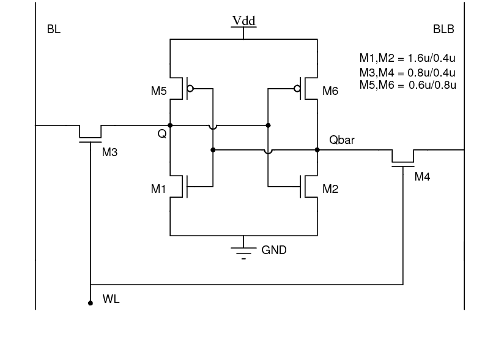
### Pre-Layout Simulation
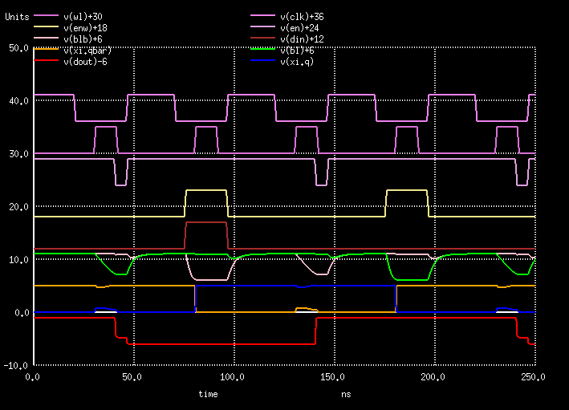
### Layout
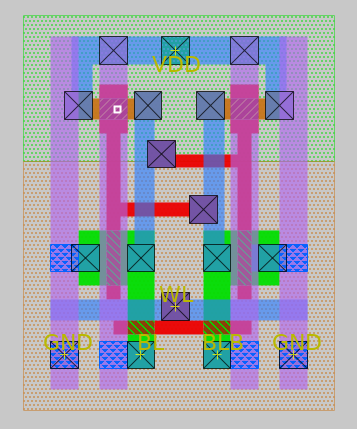
  
  Layout has been done by open-source layout tool Magic.
## SE-SRAM cell
  The single-ended 6T SRAM cell consists of two cross-coupled inverters connected to bitline(BL) with an access transistor (M5) and a data storage node isolation transistor (M6). For Read operation, a read assist transistor(Mra) is connected with an M6 transistor. One of the Inverter consists of a write assist transistor (Mwa) as shown in the figure. The read operation is controlled by the read assist transistor (Mra) by giving an input R. Similarly, the write operation is controlled by the write assist transistor (Mwa) and access transistor (M5) which depends upon the input W0 and WL.

### Circuit Diagram
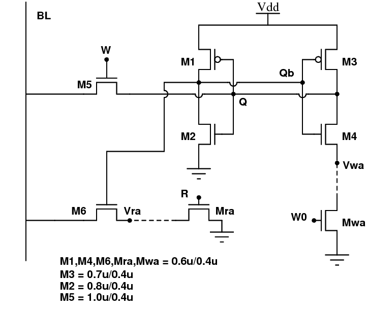
### Pre-Layout simulation
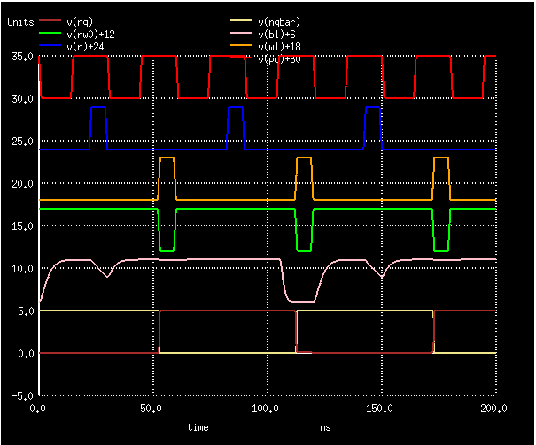
### Layout
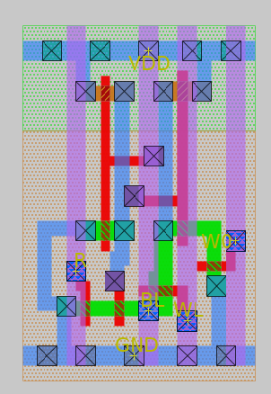

## Comparative analysis between Standard 6T SRAM cell and SE-SRAM cell
### SNM (Static Noise Margin):-
#### 6T SRAM cell
##### SNM(HOLD)
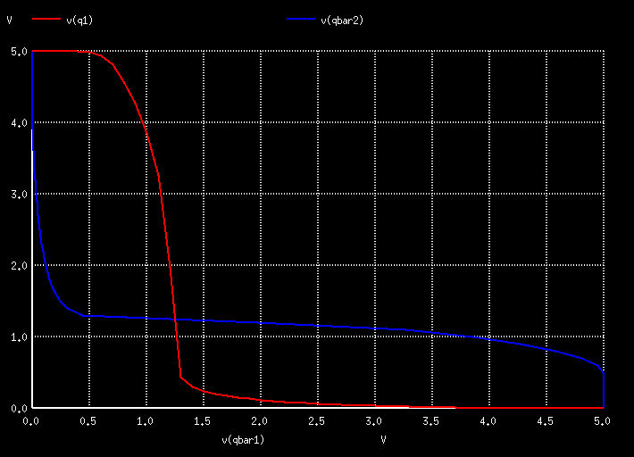
##### SNM(READ)
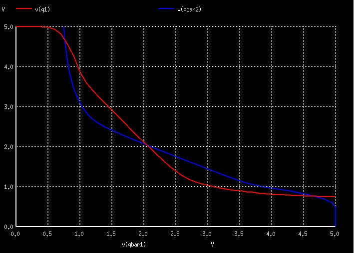
#### SE-SRAM cell
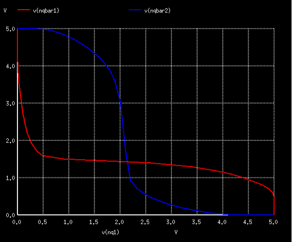
#### Read SNM for different PVT corners

  The single ended 6T bitcell provides 4.5X higher worst-case read SNM as compared to the standard 6T SRAM bitcell under the same process. variations. 
### Write-stability
##### SRAM
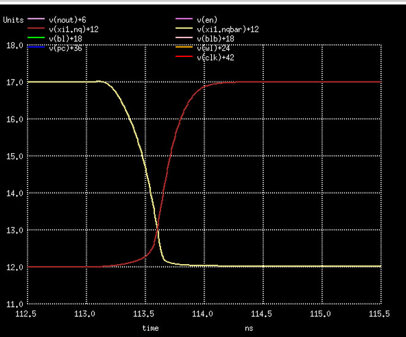
##### SE-SRAM
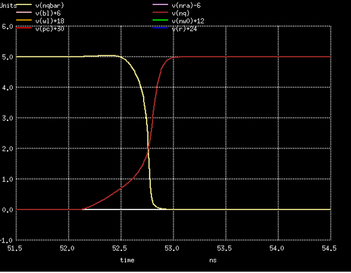

  The write trip point voltage of a SE-SRAM 6T cell is 28% (1.4V) higher than the standard 6T SRAM cell. Thus the single ended 6T design has a little bit of high write ability than the standard 6T design. However, it has an advantage since an erroneous write will not take place easily compared to standard 6T cell.

## Conclusion
This report gives a comparative study of 6T SE-SRAM & 6T SRAM cell which proves SESRAM cell robustness against process variations by featuring narrower spread in read access time distribution and strong write ability compared to standard 6T SRAM cell. The simulation measurement results confirm the successful functionality and read/write stability of the single ended design in MOSIS 0.5um SCMOS technology

## Contributor
- [CH. Ajit Kr. Patro](https://github.com/akpatro-github/) Undergraduate Student, SIT BBSR
## Acknowledgement
- Dr. Saroj Rout, Associate Professor, Silicon Institute of Technology, Bhubaneswar
- Mr. Santunu Sarangi, Assistant professor, Silicon Institute of Technology, Bhubanesar
